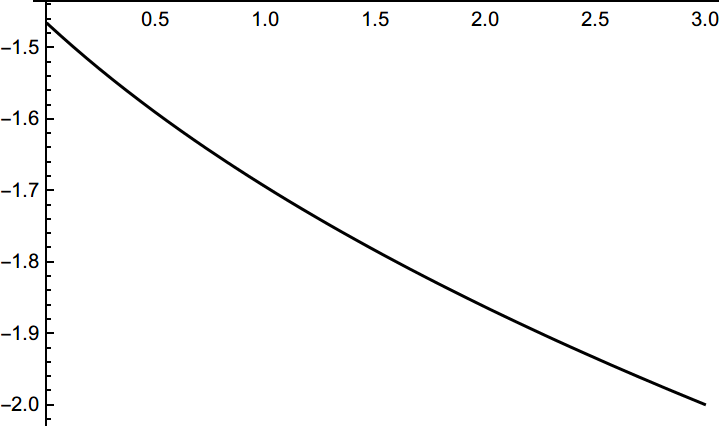
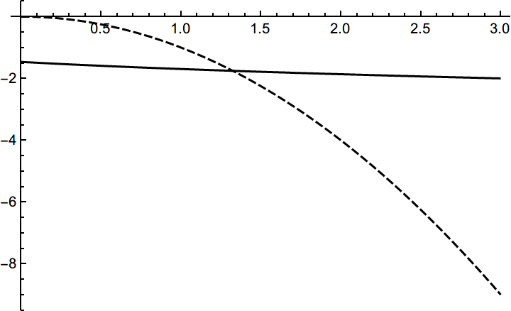

# 嵌套数值计算

## 抽象描述

如果通过数值计算功能定义一个函数，然后再将这个函数用于下一次数值计算，会产生“函数值不是数值”的消息。

## 具体例子

```mathematica
yRoot[x_] := y /. FindRoot[y^3 + y^2 + 1 + x == 0, {y, -1}]

Plot[yRoot[x], {x,0,3}, PlotTheme -> "Monochrome"]
```

定义 $yRoot(x)$ 函数的值是含参方程 $y^3+y^2+1+x=0$ 在 $y=-1$ 附近的那个根。上述代码中的定义在$x\in(0,3)$ 的范围内都有效地给出了我们想要的那个连续变化的根：



从下图可以看到关于 $yRoot$ 函数的方程 $x^2+yRoot(x)=0$ 显然在 $x\in(0,3)$ 有解：

```mathematica
Plot[{yRoot[x], -x^2}, {x, 0, 3}, PlotTheme -> "Monochrome"]
```



现在尝试用 `FindRoot` 找到这个解：

```mathematica
FindRoot[x^2 + yRoot[x] == 0, {x, 3, 0, 3}]
```

结果产生了消息 `FindRoot::nlnum` ：

```mathematica
"The function value {1. +x} is not a list of numbers with dimensions {1} at {y} = {-1.}."
```

这个消息表明，在一次 `FindRoot` 的求解中，当 $y=-1$ 时，要搜索根的表达式计算得到了非数值的结果 `1.+x` 。不难猜到，这个 `1.+x` 就是 $y=-1$ 时的 $y^3+y^2+1+x$ ，说明在某次计算`yRoot[x]`时，`x`没有取具体的数值而仍然是一个符号。

### 解决方案

此问题在这里不是致命的，即便会输出消息，你得到的结果仍是同样可靠的，所以保持原样也算是解决方案。

如果不想看到警告消息，可以采用以下方案：

#### 方案1

```mathematica
yRoot[x_] := y /. FindRoot[y^3 + y^2 + 1 + x == 0, {y, -1}]

FindRoot[x^2 + yRoot[x] == 0, {x, 3, 0, 3}, Evaluated -> False]
```

#### 方案2

```mathematica
yRoot[x_?NumericQ] := y /. FindRoot[y^3 + y^2 + 1 + x == 0, {y, -1}]

FindRoot[x^2 + yRoot[x] == 0, {x, 3, 0, 3}]
```

### 原理解释

#### `FindRoot` 的行为

`FindRoot` 具有 `HoldAll` 属性，它拿到的表达式是未经计算的，所以它在接受参数这一步并不会因为计算 `yRoot[x]` 而出错。但如果选项 `Evaluated` 被设为 `True` ，就会先计算方程，然后用计算结果参与迭代数值求解。 `Evaluated` 选项默认为 `True` ，所以用户没专门指定的时候就会先计算 `yRoot[x]` 而出错。

`FindRoot[expr, ...]` 的行为是：

1. 如果 `Evaluated -> True` ，则计算 `expr` ，然后计算类似 `FindRoot[expr, ..., Evalauted -> False]` 的表达式。
2. 如果 `expr` 是方程，则通过移项使一端为 `0` ，移项的过程中会保持所有加数不计算，仅有 `expr_-expr_ :> 0` 这样的简单规则会生效。
3. 根据指定的 `Method` 送往 ```FindRoot`Newton``` 之类的函数进行数值迭代。

关于以上说明的正确性，可以参考此例：

```mathematica
test[x_?NumericQ] := x^2+1
test[x_] := x^3+1
Trace[FindRoot[test[x] == 1+1-1, {x,0,0,3}], TraceInternal -> True]
Trace[FindRoot[test[x] == 1+1-1, {x,0,0,3}, Evaluated -> False],TraceInternal -> True]
```

#### 解决方案的原理

消息的产生是因为试图求解含未定参数的表达式的零点，所以要么阻止在计算 `FindRoot[yRoot[x]+x^2 == 0, ...]` 时计算 `yRoot[x]` ，要么阻止在计算 `yRoot[x]` 时计算 `FindRoot[y^3+y^2+x+1 == 0, ...]` 。

