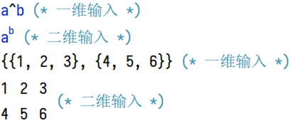
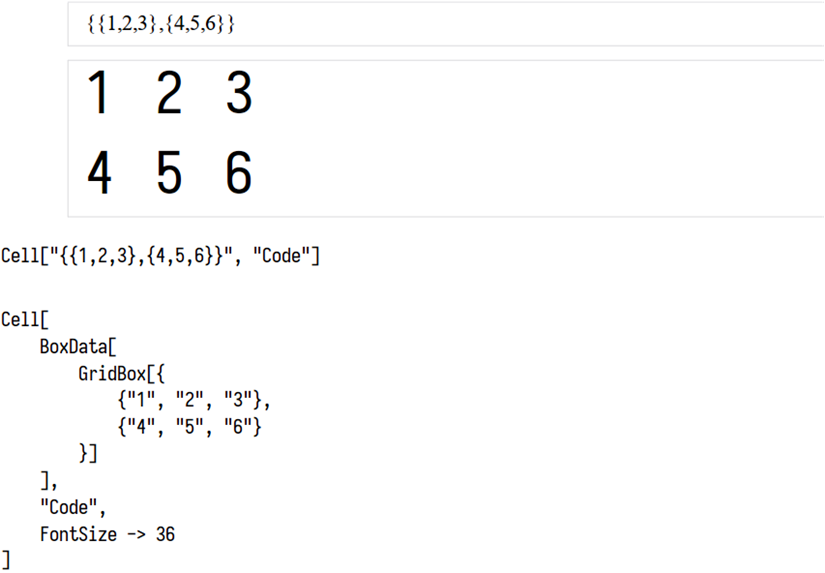

# 表达式的输入输出形式

> 有数个“萌新杀手”级别的问题，根源都是表达式的输入输出形式的不了解，故写下此篇教程解说。

这些杀手问题的特征标签：

* `MatrixForm`
* `Derivative` `Superscript` `Power`

## 框符

一般而言，如果你正在使用 Mathematica ，尤其是在使用它的二维输入功能（如上标、根号、矩阵），或者你插入了图片、音频作为表达式，那么你输入的表达式是借助 **框符** 来表示的 。



框符是 Mathematica 的排版系统所处理的基本单元，这种设计摆脱了一般编程语言的纯文本输入限制，使得你可以更方便地输入、观察。

每一个框符都可以用 `InputForm` 的 Wolfram 语言表达式来表示，上图中第二行的 $a^b$ 和第四行的 $\begin{matrix}1&2&3\\4&5&6\end{matrix}$ 分别表示为：

```mathematica
SuperscriptBox["a", "b"]
GridBox[{{"1", "2", "3"}, {"4", "5", "6"}}]
```

框符正是以 Wolfram 语言表达式的形式存储在笔记本文件中的。如果你用文本编辑器（而不是 Mathematica ）打开 Mathematica 笔记本，你就能看到许多框符表达式。

> Mathematica 笔记本格式本身存储的就是一个头部为 `Notebook` 的 Wolfram 语言表达式文本，此表达式的结构大致形如：
>
> * 文件
> 	* 版本信息
> 	* 缓存
> 	* `Notebook` 表达式
> 		* `CellGroup` 表达式
> 			* `Cell` 表达式
> 				* 单元内容（下列之一）
> 					* 字符串
> 					* `BoxData` 表达式
> 						* 各种 **框符 **构成的 `List`
> 					* 其它
> 				* 样式（由样式表定义，如 `"Title"`, `"Input"`）
> 				* 选项（如字体大小）
> 			* 单元组开关状态
> 		* 选项（如样式表、是否可编辑、是否可保存、缩放大小）

## `InputForm` 和 `StandardForm`

### 框符的计算

作为一个前端程序——一个排版渲染系统、一个用户界面，笔记本中所存储的并不是内核要执行的代码本身，而是存储了用户的输入和程序的输出。在 Mathematica 中执行 `菜单栏-计算-计算单元` 会将单元中的内容转化为可由内核计算的表达式再送往内核。

每个单元都由一个 `Cell` 表达式来表示，你可以使用 `菜单栏-单元-显示表达式` 来查看光标所在单元所对应的表达式。它形如：

```mathematica
Cell[content, style, option...]
```



在 `Cell` 表达式中，表示单元内容的 `content` 主要有两种形式：

* 字符串，内含由符合 Wolfram 语言语法的代码文本。这种形式称为 `InputForm` 。
* `BoxData[...]` 表达式，其内部可以有框符表达式。这种形式是 `StandardForm` 的一种。一般而言，Mathematica 默认将用户输入保存为此形式的单元表达式。

两者的区别简单地说来就是：前者仅包含代码的语法要素，而后者还可以包含排版信息。

计算单元时，Mathematica 会处理 `content` 然后送往内核计算，但上述两种形式的内容的处理方式是不同的：

* `InputForm` ：直接计算字符串内部的代码
* `StandardForm`：先调用 `MakeExpression` 的定义，将框符转化为表达式，再交给内核计算

`MakeExpression` 是一个将包含排版信息的表达式转化为其所要表示的代码的函数。

> 下面的代码会向你展现 Mathematica 默认将一个 `GridBox` 解释为什么：
>
> ```mathematica
> MakeExpression[GridBox[{{"1","2","3"}, {"4","5","6"}}], StandardForm]
> ```
>
> 结果是一个二层的列表——它通常被用来表示一个数学上的矩阵。
>
> 这就是为什么你用 `Ctrl+Enter` 和 `Ctrl+,`  输入的内容可以作为矩阵去参与矩阵运算：你输入的实际上是一个 `GridBox` ，它被解释为两层的列表，而双层的列表通常正是那些矩阵运算函数要求你提供的。

`MakeExpression` 的定义是可更改的，这意味着你可以让 Mathematica 按照你的想法去解释 `GridBox` 。但这非常危险，绝大多数情况不推荐修改 `MakeExpression` 的定义，因为那会影响到所有单元内容的计算。

> 下面的代码展示了 `MakeExpression` 的威力。它会造成一个恶劣的影响：计算它后，所有单元的计算结果都将为 `42` 。
>
> **尝试执行这段代码前，你应当保存你所有的工作内容。因为要抵消这个影响，除了重启内核以外的方法我都懒得介绍，想必你也懒得学。**
>
> ```mathematica
> MakeExpression[_, StandardForm] := HoldComplete[42]
> ```

### 计算结果的渲染

当你在 Mathematica 中输入 `a^2` `y'[x]` `D[f[x,y],x]`这样的表达式时，你会发现到了输出结果里面它们就变得和你输入的不同了：幂变成来上标来表示；单变量函数导数变成了上标撇号（这个撇号与`'`不同）；多变量函数的导数则由带圆括号的导数阶数来表示。

这是由于 Mathematica 默认情况下会将计算结果转化为 `StandardForm`，而 `Power` `Derivative` 这些函数具有 `StandardForm` 下的 **格式定义**(`FormatValues`)  ，正是依照了这些格式定义，`Power` 表达式才会呈现为二维输出：

```mathematica
a^b -> SuperscriptBox["a", "b"]
f' -> SuperscriptBox["f", "\[Prime]", MultilineFunction -> None]
```

建立格式定义有两种方式，一种是 `Format` ，一种是 `MakeBoxes` 。`MakeBoxes` 进行的是 `MakeExpression` 的逆过程：它依照格式定义将表达式转化为框符。

> 下面的代码展示了 `MakeBoxes` 的威力。它会造成一个恶劣的影响：计算它后，所有单元的计算结果都将为 `42` 。
>
> ```mathematica
> MakeBoxes[_, StandardForm] := "42"
> ```
>
> 虽然效果与之前 `MakeExpression` 的那段相同，但原理不同。
>
> >  要抵消上面代码的作用，只需执行：
> > ```mathematica
> > MakeBoxes[_, StandardForm] =.
> > ```

### 输入输出的前世今生

现在，展示一下 “42” 的两个例子中，输入输出的整体流程。为了叙述的完整，这一部分可能包含你未掌握的知识，但应该不妨碍你获得一个整体理解。

##### `MakeExpression` 版本

* 读取单元表达式的内容，比如 `BoxData[GridBox[{{"1","2","3"}, {"4","5","6"}}]]`
* 由于单元内容具有头部 `BoxData` ，认为内容是 `StandardForm` 的
* 按照 `StandardForm` 下 `MakeExpression` 的定义，得到要计算的表达式 `HoldComplete[42]` 。
* 将表达式送往内核，去除 `HoldComplete` 然后计算。由于 `42` 不包含符号，故无需应用任何定义，直接返回给前端，准备输出。
* 由于 `$Output` 具有选项 `FormatType -> StandardForm` （Mathematica 启动时的预设值），将表达式转化为 `StandardForm` 再输出。
* 按照 `StandardForm` 下 `MakeBoxes` 的定义，转化得到 `"42"` ，输出到 `$Output` 流。
* 前端接到输出，根据样式表设置生成相应的输出单元 `Cell[BoxData["42"], "Output"]` ，附在输入单元的下方。

##### `MakeBoxes ` 版本

* 读取单元表达式的内容，比如 `BoxData[GridBox[{{"1","2","3"}, {"4","5","6"}}]]`
* 由于单元内容具有头部 `BoxData` ，认为内容是 `StandardForm` 的
* 按照 `StandardForm` 下 `MakeExpression` 的定义，得到要计算的表达式 `HoldComplete[{{1,2,3},{4,5,6}}]` 。
* 将表达式送往内核，去除 `HoldComplete` 然后计算。由于 `{{1,2,3},{4,5,6}}` 中的符号 `List` 没有任何定义，故无需应用任何定义，直接返回给前端，准备输出。
* 由于 `$Output` 具有选项 `FormatType -> StandardForm` （Mathematica 启动时的预设值），将表达式转化为 `StandardForm` 再输出。
* 按照 `StandardForm` 下 `MakeBoxes` 的定义，转化得到 `"42"` ，输出到 `$Output` 流。
* 前端接到输出，根据样式表设置生成相应的输出单元 `Cell[BoxData["42"], "Output"]` ，附在输入单元的下方。

### 常见问题

了解以上背景知识后，我们就可以理解一些常见疑难问题的背后原理了。

#### 萌新杀手问题1：导数与上标

##### Q

* 为什么将输出单元中的导数复制为纯文本以后再执行就报错了呢？
* 为什么将输出单元中的导数有效，而我自己通过上标输入的导数无效？

##### A

`Derivative[1][f]` 的 `MakeBoxes` 结果是 `SuperscriptBox["f", "\[Prime]"]` ，这个是可以被 `MakeExpression` 正常转化回 `f'` 的。但是你如果上标的是一个 `'` 而不是`\[Prime]` ，那就不行。

`Derivative[1,0][f]`的 `MakeBoxes` 结果是

```mathematica
SuperscriptBox[
	"f",
	TagBox[
		RowBox[{"(", RowBox[{"1", ",", "0"}], ")"}],
		Derivative
	]
]
```

看到那个带`Derivative` 参数的 `TagBox` 没有？你用 `Ctrl+6` 输入的上标或者复制为纯文本再粘贴后的上标是没有这个消歧义的 `TagBox` 的，会被解释为乘方，然而指数里面的 `"(1, 0)"` 不符合乘方指数的要求，自然就报错。

#### 萌新杀手问题2：MatrixForm

##### Q

为什么我不能这样？MatrixForm 难道不是只转换了矩阵的表示形式而已吗？为什么加上它以后 `MatrixRank` 就不行了？

```mathematica
matrix = {{1,2,3}, {4,5,6}}
MatrixRank[matrix]

matrixForm = MatrixForm[{{1,2,3}, {4,5,6}}]
MatrixRank[matrixForm]
```

##### A

`MatrixForm` 并不返回列表，认为它不会影响计算是错误的。它没有计算定义，只有格式定义，只是被 `MakeBoxes` 为 `GridBox` 了，看上去跟你用 `Ctrl+Enter` 输入的一样。

##### Q

你说 `MatrixForm` 不返回列表，不能当矩阵用，那为什么我可以编辑输出了`MatrixForm`表达式的单元，或者把它复制到别的地方，又可以计算得到列表了呢？

##### A

你复制的是`GridBox` 框符，它的内置 `MakeExpression` 定义使其被解释为双层列表。编辑单元的情况同理：单元表达式里存储的是框符，而不是原始的 `MatrixForm` 表达式。

> 另可参考 [为什么我的代码加了MatrixForm后就出问题了？](https://note.youdao.com/ynoteshare1/index.html?id=d0a57819857f2771ca669eb54819e3d1&type=note)

#### 萌新好奇问题：复制粘贴乱码

复制一个包含上标框符的字符串 "$a^b$" ，会得到如下代码：

```mathematica
"\!\(\*SuperscriptBox[\(a\), \(b\)]\)"
```

这被一些人描述为“乱码”。这其实是框符的字符串表示，详见文档 `tutorial/InputSyntax` 。

